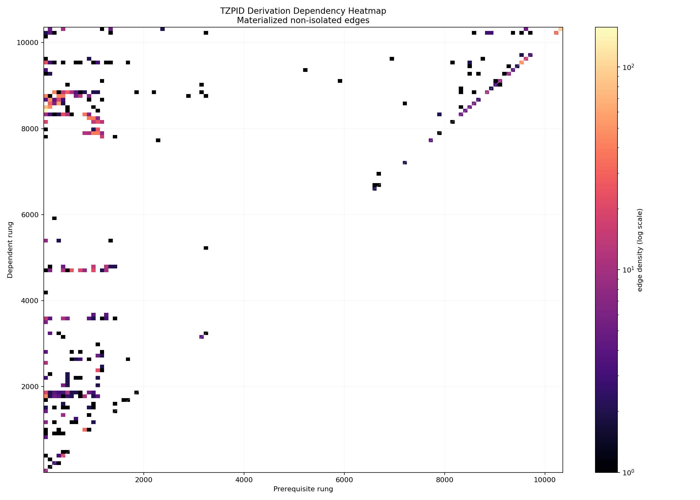

# TZPID Graph Visual Layer

Generated UTC: 2026-06-11T11:02:18.714883+00:00

This layer is the reusable Python renderer and metric checker for the derivation-order graph. It consumes `materialized_edges.csv`, verifies the directed graph with NetworkX, and renders the dependency heatmap as PNG/SVG.

## Current Metrics

| Metric | Value |
|---|---:|
| Non-isolated graph nodes | 1970 |
| Materialized edges | 2080 |
| Weak connected components | 231 |
| Nontrivial components | 231 |
| Largest component nodes | 1046 |
| Cyclic | false |
| Longest path depth | 67 edges / 68 nodes |

## Visual Outputs

- `dependency_heatmap_nonisolated.png`
- `dependency_heatmap_nonisolated.svg`



## Reproduce

```powershell
python D:\TZPIDProof\graph_topology\tzpid_graph_layer.py --render
```

## Notes

The heatmap is a density visualization, not a proof by itself. The formal derivation-order proof remains in `tzpid_proof/isabelle_tzpid/TZPID_DerivationOrder.thy`.
